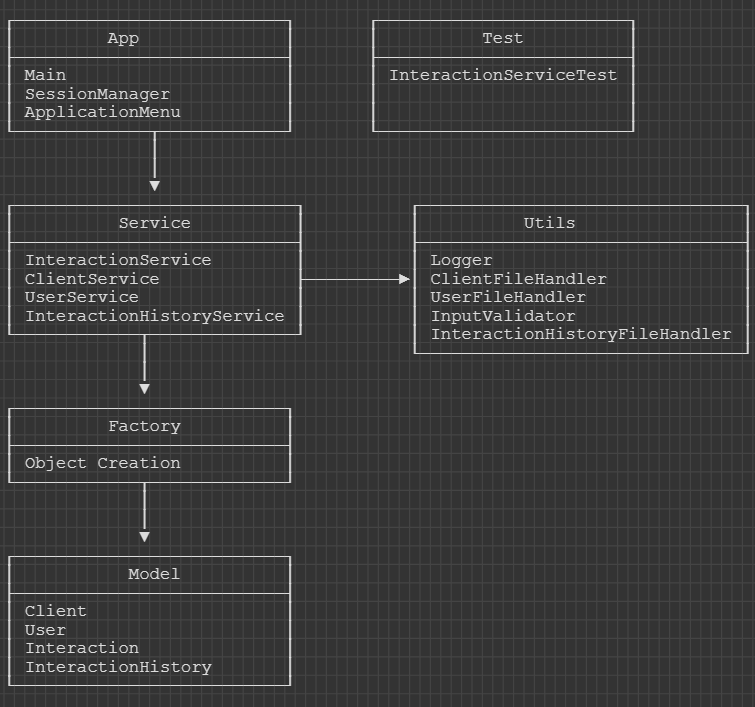

# CRM Java Project

## 📖 Description: 

This project is about customer management.

## 🛠️ Technologies and Design Patterns Used

| Component           | Technology/Pattern                             | Purpose                                                                 |
|---------------------|------------------------------------------------|-------------------------------------------------------------------------|
| File Storage        | Java IO                                        | To keep traceability across program executions                          |
| Collections         | ArrayList                                      | To store and manipulate entities (user, interactions etc...)            |
| Singleton Pattern   | in services (e.g ClientService                 | To guarantee a single access point to the services                      |
| Factory Pattern     | Entity creation (e.g user, client etc...)      | To separate responsabilities, define and centralize object creation     |
| Composite Pattern   | Interactions hierarchies                       | To unify display method behaviour of interaction interaction components |
| Iterator Pattern    | Generic iterator & InteractionHistoryIterator  | To iterate and remove element from collection                           |
| Exception Shielding | try/catch + Logger                             | To avoid crash and hide stack traces                                    |
| Logging             | Custom Logger.java                             | To save precisely a record of technical errors and internal events      |
| Multithreading      | Used during file updating (new Tread + lambda) | To save data asynchronously without blocking user experience            |
| Lambda Expressions  | Runnable lamda for multithreading              | To support multithreading                                               |

## ⚙️ Setup and Execution Instructions

To run this project locally, follow the steps below:

1. **Clone** the project source code into a computer.
2. Open the project in **IntelliJ IDEA**.
3. Make sure jdk version  is set to minimum  **23.0.2**.
4. Go to the `app/Main.java` file.
5. Use the console to register, log in, and create clients, users, or interactions and many others operations.

> 💡 All data is stored in local files `data/*.java` using Java I/O.

## UML diagrams (class & architectural)

<<interface>> Entity
-------------------------------------------------------------------
+ getId(): int
-------------------------------------------------------------------

Client implements Entity
-------------------------------------------------------------------
- id: int
- firstName: String
- lastName: String
- email: String
- phoneNumber: String
- companyName: String
-------------------------------------------------------------------
+ Client(...)
+ getId(): int
+ getFirstName(): String
+ getLastName(): String
+ getEmail(): String
+ getPhoneNumber(): String
+ getCompanyName(): String
+ toString(): String
-------------------------------------------------------------------

User implements Entity
-------------------------------------------------------------------
- id: int
- firstName: String
- lastName: String
- email: String
- role: String
- hashedPassword: String
-------------------------------------------------------------------
+ User(...)
+ getId(): int
+ getFirstName(): String
+ getLastName(): String
+ getEmail(): String
+ getRole(): String
+ getHashedPassword(): String
+ toString(): String
-------------------------------------------------------------------

<<interface>> InteractionComponent
-------------------------------------------------------------------
+ display(): void
-------------------------------------------------------------------

Interaction implements InteractionComponent, Entity
-------------------------------------------------------------------
- id: int
- type: String
- userId: int
- description: String
- interactionDate: String
- clientId: int
- formatter: DateTimeFormatter
-------------------------------------------------------------------
+ Interaction(...)
+ getId(): int
+ getType(): String
+ getUserId(): int
+ getDescription(): String
+ getInteractionDate(): String
+ getClientId(): int
+ setDescription(String): void
+ display(): void
+ toString(): String  
-------------------------------------------------------------------

InteractionHistory implements InteractionComponent
-------------------------------------------------------------------
- id: int
- title: String
- clientId: int
- interactions: ArrayList<InteractionComponent>
-------------------------------------------------------------------
+ InteractionHistory(...)
+ addInteraction(InteractionComponent): void
+ getClientId(): int
+ getTitle(): String
+ getId(): int
+ getInteractions(): ArrayList<InteractionComponent>
+ display(): void
-------------------------------------------------------------------

AbstractEntityFactory
-------------------------------------------------------------------
+ createEntity(args): Entity 

ClientFactory / UserFactory / InteractionFactory / InteractionHistoryFactory: extend AbstractEntityFactory
-------------------------------------------------------------------
- idCounter: AtomicInteger
-------------------------------------------------------------------
+ createEntity(args): Entity
-------------------------------------------------------------------

### Relations:
- Client, User, Company implement Entity
- Interaction & InteractionHistory implement InteractionComponent and Entity
- AbstractEntityFactory is extended by ClientFactory, UserFactory, InteractionFactory, InteractionHistoryFactory
- InteractionHistory contains multiple InteractionComponent (Interaction or InteractionHistory)

                                       